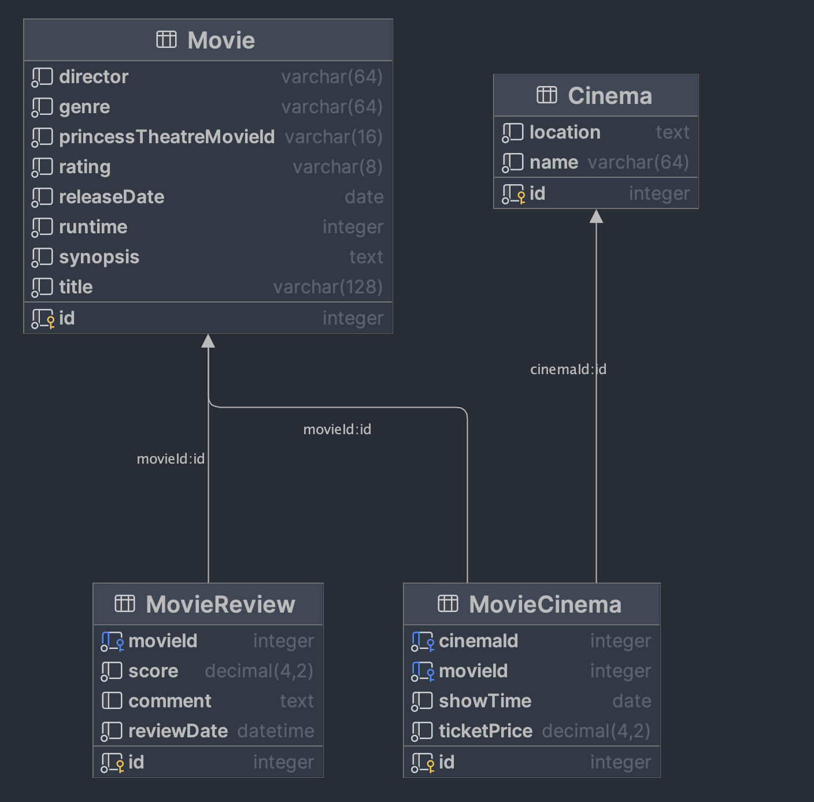

## Princess theatre Api key:  
Place the api key in [appsettings.Development.json](MovieHub.API/appsettings.Development.json) in order to make api calls to the princess theatre api.
## Getting Started
1. To run the app:
```shell
dotnet run --project MovieHub.Api/MovieHub.Api.csproj
```
2. To run all the integration tests:
```shell
dotnet test
```
## MovieHub DB mapping:

